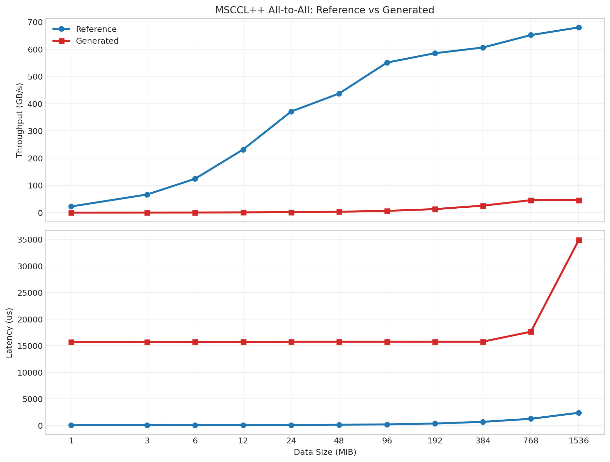

<p>
<strong>By: TBD
<br>
Date: May 13, 2026
</strong>
</p>

<div class="tldr">
<p>
Today's frontier LLMs write great single-device code but consistently fail on multi-device GPU communication — the kind of code that actually bottlenecks large-scale LLM training, post-training, and inference. We present a benchmark spanning <strong>NCCL</strong>, <strong>mscclpp</strong>, <strong>RDMA verbs</strong>, and <strong>compute-communication fusion</strong> kernels, evaluate closed and open frontier models with a compilation-feedback loop, and share case studies of where and why models break down. We also outline a post-training research agenda to close this gap.
</p>
<p>
Dataset and benchmark scripts: <a href="https://github.com/uccl-project/llm-for-gpu-comm/tree/main">github.com/uccl-project/[UBench]</a>
</p>
</div>

## Why Multi-Device Coding Matters — and Why LLMs Are Bad at It

Communication and compute-communication fusion sit at the critical path of every serious LLM workload today. In production training, communication can consume **43.6% of the forward pass** [1]; in MoE inference with wide expert parallelism, inter-device communication accounts for **up to 47% of total execution time** [2]. Getting this code **right** and **fast** is not a nice-to-have.

Three forces are making hand-written, NCCL-style communication increasingly inadequate:

**GPUs are getting faster, so communication must move onto the GPU.** Per-chip throughput is now multi-PFLOP-scale. At these speeds, the CPU intervention in conventional collective libraries — a `cudaLaunchKernel`, an inter-stream event, a host-side "all writes done" check — shows up directly as a pipeline bubble. Communication needs to be **GPU-initiated**: triggered from inside the kernel, without bouncing through the host. Libraries like **MSCCLPP** and **IBGDA** exist precisely for this, but they expose very low-level primitives that are far outside the typical training distribution of a coding model.

**GPU time is expensive, so kernels must be customized per architecture.** The right all-to-all implementation for an H200 over NVLink looks nothing like the right one for an AMD MI325x over InfiniBand. Squeezing idle GPU cycles requires writing kernels from scratch, tailored to the memory hierarchy, warp scheduler, and NIC capabilities of the specific hardware. This is exactly the kind of long-tail, architecture-specific code that LLMs have the least training signal on.

**Communication is becoming irregular and fine-grained, especially in MoE.** Expert Parallelism in mixture-of-experts models produces dynamic, non-uniform all-to-all patterns that NCCL's bulk-synchronous collective model handles poorly. Efficient MoE dispatch requires custom GPU kernels that interleave routing decisions, RDMA writes, and local compute — compute-communication fusion at the tile level. No off-the-shelf library does this well, and LLMs have almost no exposure to the relevant code patterns.

Despite all this, multi-device coding has been **largely overlooked** in LLM coding benchmarks. HumanEval, MBPP, LiveCodeBench — these measure single-device reasoning. There is no established benchmark for whether a model can write a correct, performant mscclpp kernel, an RDMA write loop with proper memory ordering, or a fused AllGather+GEMM across NVLink and InfiniBand. We aim to take the first step in filling that gap.

---

## Benchmark Structure

Our benchmark covers four categories of multi-device communication tasks, drawn from real industry use cases in the UCCL project:

| Category | Examples |
|---|---|
| **Inter-node RDMA basics** | libibverbs QP setup, RDMA write, write-with-IMM, memory registration |
| **Intra-node NVLink basics** | TMA-based transfers, DMA engines, register-level copy |
| **GPU-initiated communication** | MSCCLPP MemoryChannel/ProxyChannel, NVSHMEM |
| **Compute-communication fusion** | AllGather+GEMM, MoE dispatch+GEMM, QKNorm+AllReduce |

Each task asks a model to implement a specific primitive using a specified library and target hardware. The prompt includes the communication pattern, library API, and cluster topology (number of ranks, message sizes, NIC type).

**Compilation feedback loop.** After each generation, we compile the kernel and feed the full compiler output back as context for the next round. We allow up to **five rounds**. A task is marked a compilation failure if no round produces a clean build. For all kernels that do compile, we measure achieved bandwidth or latency against a hand-crafted reference implementation.

Models evaluated: **DeepSeek V4 Pro**, **GPT-5.2**, **Gemini-3-Pro**.

Hardware: Nvidia Blackwell 300, Nvidia Grace Hopper 200, AMD MI325x.

---

## Case Studies

### NCCL

*[TBD]*

### RDMA Verbs

*[TBD]*

### ThunderKitten

*[TBD]*

### MSCCLPP All-to-All

<a href="https://github.com/microsoft/mscclpp">mscclpp</a> is Microsoft's low-level GPU communication library designed for fine-grained control over RDMA and NVLink transfers. mscclpp has very elegant and efficient abstraction like memorychannels and portchannels.

First, here is a brief overview of what **all-to-all** fulfills: every rank simultaneously sends a distinct data chunk to every other rank. This is among the most demanding collectives, requiring coordination of N×(N-1) concurrent transfers, each with its own buffer offset, channel handle, and synchronization barrier.

#### DeepSeek V4 Pro: five rounds, zero compilations

Over five rounds of prompting, with full compiler feedback provided after each attempt, DeepSeek V4 Pro failed to produce a single compilable kernel. The generated code repeatedly hallucinated APIs, relied on nonexistent abstractions, and assumed outdated MSCCL++ interfaces that no longer matched the installed runtime. Even after iterative correction attempts, the model never converged to a buildable implementation.

#### GPT-5.5 triage, Human in the loop

We then switched to GPT-5.5 through Codex, not to optimize performance initially, but simply to recover a compilable and runnable baseline implementation for comparison purposes.

The transition from “compilation failed” to “compilation passed” took approximately 2 minutes and 53 seconds of iterative reasoning and quick build testing. Moving from “compiles but fails at runtime” to “fully runnable and correctness passing” required substantially more work, taking roughly 17 minutes and 23 seconds.

A human remained in the loop throughout the process, primarily to provide coarse-grained feedback such as whether compilation succeeded, and whether correctness checks passed or failed. The model itself handled the bulk of the API migration and structural debugging.

The progression from uncompilable code to a correctness-passing implementation involved a surprisingly deep stack of fixes, ranging from superficial header cleanup to subtle distributed runtime semantics.

The most obvious issue was the removal of a hallucinated header, ```mscclpp/tcp_bootstrap.hpp```, which did not exist in the installed MSCCL++ version. From there, GPT-5.5 restructured the bootstrap initialization flow to match the actual API surface, replacing generated assumptions with a ```std::shared_ptr<mscclpp::TcpBootstrap>``` followed by explicit initialize(unique_id) calls.

More importantly, the model recognized that the generated code fundamentally misunderstood the role of ```mscclpp::Communicator```. The original implementation attempted to construct low-level peer connections directly, bypassing the abstraction layer already provided by modern MSCCL++. GPT-5.5 rewrote this section to use ```mscclpp::Communicator``` as the central orchestration primitive.

This cascaded into a series of API migrations. Invalid calls such as ```bootstrap_.createConnections(...)``` were replaced with ```comm_->connect(mscclpp::Transport::CudaIpc, peer)``` and the associated future collection flow. Incorrect memory registration paths like ```connections_[rank_].registerMemory(...)``` were rewritten to use ```comm_->registerMemory(..., mscclpp::Transport::CudaIpc)```.

The generated implementation also attempted to serialize and exchange memory regions through nonexistent ```RegisteredMemory::pack/unpack``` routines. GPT-5.5 replaced this logic entirely with ```comm_->sendMemory(...)``` and ```comm_->recvMemory(...)```, matching the actual communication semantics expected by MSCCL++.

Several deeper structural hallucinations appeared around channel construction and device-side synchronization. Nonexistent methods such as ```createMemoryChannel(...)```, ```deviceCopy(...)```, and semaphore ```post()``` calls had to be replaced with the actual device-handle abstractions supported by the library, including explicit ```mscclpp::MemoryChannel``` construction and device-handle ```put(...)``` signaling paths.

Even aggregation logic was incorrect. The generated implementation attempted to perform byte-level allgather operations through unsupported Connection::send/recv flows. GPT-5.5 rewrote this section using ```bootstrap_->allGather(...)``` for correctness propagation and latency collection.

Finally, there were lower-level CUDA integration bugs that only surfaced after the API layer had been repaired. One example was cooperative kernel launch argument of ```const``` type: the generated code attempted to pass const values through mutable ```void* args[]``` arrays. GPT-5.5 resolved this by introducing a local mutable copy of ```num_gpus_``` before launch.

At that point, the codebase finally crossed the boundary from “does not compile” to “compiles successfully.” However, runtime execution still failed. Additional debugging iterations were required before the implementation eventually became both runnable and correctness passing.


Compilation passing turned out to be only the beginning. The GPT-5.5-fixed kernel ran but produced incorrect results. Six patches were needed. 

The first two exposed the deepest API knowledge failure: the kernel had invented a separate ```constSemaphores``` table and attempted to signal ```constSemaphores[rank]```, again, something that does not exist, when in fact mscclpp embeds synchronization directly inside each ```MemoryChannel```. The model knew that all-to-all requires synchronization; it did not know where mscclpp puts it. 

Fix three followed from the same conceptual gap: the kernel was signaling and waiting on itself, which makes no sense for a collective where self-transfers are local copies with no remote channel involved. 

Fix four was a more fundamental CUDA error, independent of mscclpp entirely: every thread was copying the entire local slice rather than taking a strided subset, so ```N``` threads were each doing N-threads worth of redundant work. 

Fix five was the most subtle: the verification harness used fill values of ```rank * 1000 + peer```, which silently round to multiples of 1000 in ```BF16``` precision, making the checker blind to an entire class of data corruption. Changing the pattern to ```rank * 16 + peer``` made the verification faithful. 

Taken together, these patches reveal that the LLM failed at four distinct levels simultaneously: mscclpp API semantics, collective communication logic, basic GPU parallelism, and numerical precision of the test harness. Compiler feedback alone, however many rounds, cannot surface any of them.

#### Performance



The DeepSeek-generated kernel (after 5 rounds of compiler-feedback prompting, 2 rounds of GPT-5.5 triage and human in the loop) passes correctness but is catastrophically slower than the reference across all message sizes. 

At 1 MiB, the reference achieves 22.5 GB/s while the LLM kernel achieves 0.067 GB/s. This is a 336× gap. At 1536 MiB the gap narrows to 15× (680 GB/s vs. 46 GB/s), but never closes. 

#### Why does this happen?

Two independent failure modes explain this. 

First, the kernel incurs a fixed ~15,700 microsecond overhead on every launch regardless of message size — visible in the nearly flat latency from 1 MiB to 384 MiB — caused by cooperative_groups::grid_group::sync(), a grid-wide barrier that synchronizes all blocks across all GPUs and involves the host on the synchronization path. This single design choice turns every all-to-all into a ~15 ms fixed tax before any data moves. 

Second, even at large messages where the fixed overhead amortizes, throughput plateaus at ~46 GB/s because synchronization is handled by a single thread (blockIdx.x == 0 && threadIdx.x == 0) serially posting to each peer's semaphore and waiting for all N peers — a fully serialized fence where the reference uses per-chunk, warp-specialized signal()/wait() pipelined across 16 dedicated put-warps and 16 dedicated copy-warps. The LLM understood that all-to-all requires synchronization; it did not know how mscclpp expects that synchronization to be structured at the warp level.


```
generated kernel
   119  __global__ void __launch_bounds__(1024) alltoall2(int rank, int nRanksPerNode, size_t nElements, void* inputBuffer,
   120                                                    void* scratchBuffer, void* resultBuffer) {
   121    namespace cg = cooperative_groups;
   122    cg::grid_group grid = cg::this_grid();
   123
   124    using bf16 = __nv_bfloat16;
   125    bf16* input = reinterpret_cast<bf16*>(inputBuffer);
   126    bf16* output = reinterpret_cast<bf16*>(resultBuffer);
   127
   128    const int numPeers = nRanksPerNode;
   129    const size_t sliceSize = (nElements + kChannelsPerConnection - 1) / kChannelsPerConnection;
   130    const int totalTasks = numPeers * kChannelsPerConnection;
   131
   132    for (int task = blockIdx.x; task < totalTasks; task += gridDim.x) {
   133      int peer = task / kChannelsPerConnection;
   134      int chan = task % kChannelsPerConnection;
   135
   136      size_t start = chan * sliceSize;
   137      size_t end = (start + sliceSize) > nElements ? nElements : (start + sliceSize);
   138      size_t count = end - start;
   139      if (count == 0) continue;
   140
   141      size_t srcOff = peer * nElements + start;
   142      size_t dstOff = rank * nElements + start;
   143
   144      if (peer == rank) {
   145        // local copy
   146        for (size_t i = threadIdx.x; i < count; i += blockDim.x) {
   147          output[dstOff + i] = input[srcOff + i];
   148        }
   149      } else {
   150        // remote copy via memory channel
   151        int chBase = peerChannelOffsets[peer];
   152        if (chBase < 0) continue;
   153        int chIdx = chBase * kChannelsPerConnection + chan;
   154        // Copy handle to local variable to avoid const-qualification issues
   155        DeviceHandle<mscclpp::MemoryChannel> handle = constMemChans[chIdx];
   156        handle.put<4, true>(dstOff * sizeof(bf16), srcOff * sizeof(bf16), count * sizeof(bf16), threadIdx.x,
   157                            blockDim.x);
   158      }
   159    }

```


The generated kernel implements all-to-all as a clean high-level data-movement abstraction. It splits each peer’s slice into 64 channel-sized tasks, let blocks walk those (peer, channel) tasks, and use MemoryChannel::put() to write directly into the remote rank’s output buffer. 
You can see that structure in generated_mscclpp_all2all_hard_deepseek-v4-pro_round5_20260513_141427.cu (line 128): it computes sliceSize, maps task to peer and chan, copies local data with a simple strided loop, and sends remote data with handle.put<4, true>(...) at line 156 (line 156). 


The host-side setup mirrors that abstraction: register input/output memory, exchange output memory regions, construct per-peer memory channels, and copy the handles into constant memory at lines 227-268 (line 227). 

It is conceptually readable: “every rank writes its pieces to the right remote output, then everyone synchronizes.” The problem is that the synchronization is bolted on after the bulk transfer: grid.sync() at line 161 (line 161), a system fence, then one single thread signals and waits for every peer at lines 167-180 (line 167), followed by another grid.sync() at line 184 (line 184). That makes it correct, but it turns synchronization into a global phase boundary.

The reference kernel is organized around the lower-level motif MSCCL++ wants: not “copy everything, then synchronize,” but “pipeline chunk movement and synchronization together at warp granularity.” 

```
133  __global__ void __launch_bounds__(1024) alltoall2(int rank, int nRanksPerNode, size_t nElements, void* inputBuffer,
   134                                                    void* scratchBuffer, void* resultBuffer) {
   135  #if defined(__CUDA_ARCH__)
   136    constexpr int nWarpForPut = 16;
   137    constexpr int nWarpForCopy = 16;
   138    constexpr int putStartWid = 0;
   139    constexpr int putEndWid = putStartWid + nWarpForPut;
   140    constexpr int copyStartWid = putEndWid;
   141    constexpr int copyEndWid = copyStartWid + nWarpForCopy;
   142    constexpr size_t unit = 1 << 18;  // 256K
   143
   144    size_t totalCount = nElements * sizeof(int);
   145    size_t nBytesPerBlock = (totalCount + (gridDim.x - 1)) / gridDim.x;
   146    nBytesPerBlock = nBytesPerBlock / 16 * 16;  // alignment
   147    size_t nBytesForLastBlock = totalCount - (nBytesPerBlock * (gridDim.x - 1));
   148    size_t totalBytesForCurrentBlock = nBytesPerBlock;
   149    if (blockIdx.x == gridDim.x - 1) {
   150      totalBytesForCurrentBlock = nBytesForLastBlock;
   151    }
   152    size_t nIters = (totalBytesForCurrentBlock + unit - 1) / unit;
   153    int wid = threadIdx.x / WARP_SIZE;
   154    int lid = threadIdx.x % WARP_SIZE;
   155    DeviceHandle<mscclpp::MemoryChannel>* memoryChannels = constMemChans + blockIdx.x * (nRanksPerNode - 1);
   156    if (wid == 0 && lid < nRanksPerNode - 1) {
   157      memoryChannels[lid].relaxedSignal();
   158      memoryChannels[lid].relaxedWait();
   159    }
   160    __syncthreads();
   161    size_t lastIterSize = totalBytesForCurrentBlock - (nIters - 1) * unit;
   162    mscclpp::copy((char*)resultBuffer + rank * totalCount, (char*)inputBuffer + rank * totalCount, totalCount,
   163                  threadIdx.x + blockIdx.x * blockDim.x, gridDim.x * blockDim.x);
   164    for (int step = 0; step < nRanksPerNode - 1; step++) {
   165      int peer = (rank + step + 1) % nRanksPerNode;
   166      int peerToCopy = (rank - (step + 1) + nRanksPerNode) % nRanksPerNode;
   167      int peerId = peer < rank ? peer : peer - 1;
   168      int peerIdForCopy = peerToCopy < rank ? peerToCopy : peerToCopy - 1;
   169      size_t startOffset = peer * totalCount + blockIdx.x * nBytesPerBlock;
   170      size_t startCopyOffset = peerToCopy * totalCount + blockIdx.x * nBytesPerBlock;
   171      size_t dstOffset = rank * totalCount + blockIdx.x * nBytesPerBlock;
   172      size_t size = unit;
   173      if (wid >= putStartWid && wid < putEndWid) {
   174        int tidInPut = wid * WARP_SIZE + lid - putStartWid * WARP_SIZE;
   175        for (size_t i = 0; i < nIters; i++) {
   176          if (i == nIters - 1) {
   177            size = lastIterSize;
   178          }
   179          mscclpp::copy((char*)memoryChannels[peerId].dst_ + dstOffset + i * unit,
   180                        (char*)inputBuffer + startOffset + i * unit, size, wid * WARP_SIZE + lid,
   181                        nWarpForPut * WARP_SIZE);
   182          asm volatile("bar.sync %0, %1;" ::"r"(15), "r"(nWarpForPut * WARP_SIZE) : "memory");
   183          if (tidInPut == 0) {
   184            memoryChannels[peerId].signal();
   185          }
   186        }
   187      } else if (wid >= copyStartWid && wid < copyEndWid) {
   188        int tidInCopy = wid * WARP_SIZE + lid - copyStartWid * WARP_SIZE;
   189        for (size_t i = 0; i < nIters; i++) {
   190          if (tidInCopy == 0) {
   191            memoryChannels[peerIdForCopy].wait();
   192          }
   193          if (i == nIters - 1) {
   194            size = lastIterSize;
   195          }
   196          asm volatile("bar.sync %0, %1;" ::"r"(14), "r"(nWarpForCopy * WARP_SIZE) : "memory");
   197          mscclpp::copy((char*)resultBuffer + startCopyOffset + i * unit,
   198                        (char*)scratchBuffer + startCopyOffset + i * unit, size, tidInCopy, nWarpForCopy * WARP_SIZE);
   199        }
   200      }
   201    }
   202  #endif
   203  }
```

In ref_mscclpp_all2all.cu (line 136), it splits the block into 16 put warps and 16 copy warps, chooses a 256 KiB pipeline unit at line 142 (line 142), and computes each thread’s warp id/lane id at lines 153-154 (line 153). Then it rotates through peers in nRanksPerNode - 1 steps at line 164 (line 164): put warps copy a chunk into the remote scratch/output path and immediately signal() at lines 173-185 (line 173), while copy warps wait() for the corresponding peer chunk and move it onward at lines 187-198 (line 187). The named barriers, bar.sync IDs 15 and 14 at lines 182 and 196 (line 182), synchronize only the relevant warp groups instead of stalling the whole grid. Its channel setup also reflects this block/channel layout: handles are ordered by channel, then peer, and copied to constMemChans at lines 363-382 (line 363). So the reference is less “pretty” at the abstraction level, but much more precise where performance lives: it turns all-to-all into a streaming protocol of chunk copies, warp-local barriers, and per-chunk semaphore handshakes.

---

## Next Steps: Post-Training with RL
*[TBD]*

---

## Conclusion
*[TBD]*


---

## References

1. Chao Jin et al. *MegaScale-MoE: Large-Scale Communication-Efficient Training of Mixture-of-Experts Models in Production*. EuroSys, 2026.
2. Shulai Zhang et al. *Comet: Fine-grained Computation-communication Overlapping for Mixture-of-Experts*. MLSys, 2025.
3. Changho Hwang et al. *MSCCL++: Rethinking GPU Communication Abstractions for AI Inference*. ASPLOS, 2026